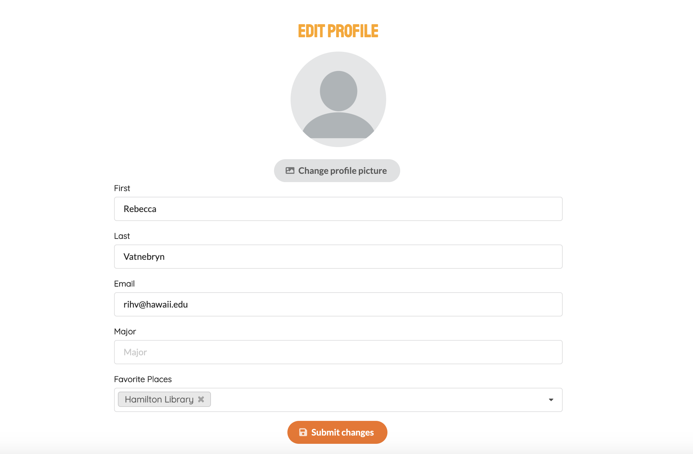

<h3>Overview</h3>
Studious Manoa is a webapplication developed as a school project. The purpose of the webpage is to make it easier for students at UH Manoa to find a place to study, more effectively. 

 

Students often go to the same places to study and aren´t aware of all the possible places to study. This webapplication allows the students to find all the different study spots and also to see which ones that are available on campus.

The appication offer to filter the studyspots after your preferences. It is also possible to rate and post comments about the different study spots. This will make the students more aware of how the different study spots are and for example if it´s full.

<h3>My experience</h3>

The project is made by a group of five people and we have been working with the project for approximately five weeks. 

To start with I worked with the user interface and figured out theme and colors. I worked with designing mockups for the general layout to the page. I also made the logo to the front page. After that I designed the profile page and edit profile page, and gave it functionality.

Unfortunately we had some issue regarding getting the right data from the database close to the deadline. This resulted in that we removed the whole profile page, but here are some screenshots of what it looked like. The problem was that we could not load the right data from the spesific user from the sign up/sign in page, because the data were located at different locations.
 
 

Disregard this, I learned a lot during this project. We used agile project management as progress method, and I must admit I really like the way of develop a project. We broke the project in to three periods, where each periods work was based on what we did in the last period. By doing this, we could costumize the work after the unpredicted problems that occured during the project.

 
If you would like to check out our webpage, click <a href="http://studious.toomanyco.ws/#/">here </a>, and if you would like to read more about the project, click click <a href="https://studious-manoa.github.io/">here. </a>
